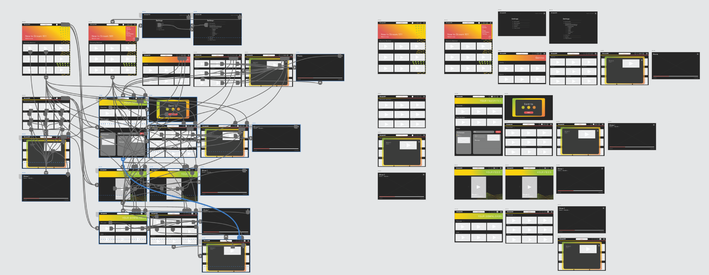

# DH150-Assignment-08
### DH 150: UX/UI by Ainsleigh Douglas

## Introduction
  It's important in this day in age to find ways to destress and create a sense of relaxation. Simple pleasures to often appear as alone time with your personal device in a quiet area of your home. Since technology is so embedded in our everyday lives we often find solace in a good TV show and a nice snack. It is important that streaming devices are easy to use and intuitive, but most importantly that way there is no extra stress added. If the user's cognitive load is burdened with over complicated tasks then the app/site will be doing the opposite of its given purpose.

## Design Statement
  This prototype was designed keeping in mind middle aged women and what would assist in their interaction with the website. I kept in mind average technology experience/knowledge, accessibility of visuals and low cognitive stress. During the user's experience they should have the ability to navigate the site to any extent they want, from searching a specific genre to being directed to a specific show.

1. Personalize home screen in settings
- This is a new feature I designed keeping in mind customizability and preference when using a streaming platform. The user should be able to manipulate and customize their home screen to their preferences. Ex// the user wants “suggested shows” to be at the top of the home page because that is what they use the most. Although setting this feature up may be out of some users comfort zone, in the long run it reduces cognitive stress.

2. Use favorites in the toolbar and “share a show”
- I created a feature in which the user can share moments in movies/shows, without having to go outside of the platform to communicate.  

3. Access “your feed” through the live icon in the toolbar and start watching a show
- “Your feed” is a new way of viewing your suggested and recently watched categories in a way that allows you to preview the first 15 seconds of each show in a social media type setting. This way if you are undecided on what you like to watch this feature initiates and feeds you the show. In this case you are more likely to decide on something faster because it is right in front of you. Since this is a completely new feature and icon I created for my streaming platform and I wanted to see if the user could find and access it using the powers of deduction.

## Competitor analysis
  Usability testing of a streaming device is critical to ensure that tasks are intuitive, even when trying to include a variety of information on said app. UT helps the designer better understand the level of knowledge/relationship a specific audience has with an interface. In my research, streaming platforms come in a wide variety of options, some are easier to use than others. From past experience, Hulu is deemed one of the least intuitive platforms, however it has one of the most abundant selections. Different age groups and demographics have varying experience using streaming platforms and things that should seem obvious may not be. A mid-aged woman may want to complete a certain task that is difficult to do on Hulu, which affects her overall experience and happiness rating.

[Hulu](hulu.com) | [9Anime](9anime.to)
--- | --- 
 Hulu is a streaming platform that provides a variety of shows, movies and Live television to its users. Hulu is customizable, kid friendly and requires a subscription. Overall Hulu provides a lot of great shows and has a great aesthetic, but I have had multiple issues with the platform not working on my app or my desktop and has left me discouraged from using it. | 9Anime is a streaming service that provides a multitude of anime shows and movies. This platform is unsanctioned which leads to many hiccups, however it functions well and provides the users with basic necessities.
 
For more on Competitor analysis: [Heuristic Evaluation](https://github.com/ainsleighdouglas/Heuristic-Evaluation) & [Usability Testing](https://github.com/ainsleighdouglas/DH-150-A02)

## User research
This project explores the decompression/relaxation needs of the user and how to reduce one's cognitive load when watching a streaming platform. Ideally by exploring the results of these experiments will lead to a smoother and effortless interaction with streaming platforms and exploring streaming platforms as a proven stress relief and unwinding mechanism. This activity touches on the user’s physiological needs, social belonging and self-actualization. Physiological needs because a rejuvenated mind is necessary to one's physical health and mental health. Social belonging because shows/movies are an avenue to social interaction as well as a deeper connection to others. Lastly, self-actualization because it is an outlet to fulfill one's desire of how to become a better version of themselves.

For more on [User Research](https://github.com/ainsleighdouglas/DH-150-Assignment04)

## UX storytelling
The purpose of UX storytelling is to put yourself in the shoes of the user to better understand their actions. The idea is to understand how the user feels when they use the product and how that can result in negative or positive emotions.
- Customizable homepage (ability to move around the categories to what you prefer at the top, recents, suggested, genres, liked, etc)
- Transparency in what's available, search availability

<table>
  <tr>
    <td>  </td>
     <td>  </td>
  </tr>
</table>

 

To see all the personas and scenarios: [UX Storytelling](https://github.com/ainsleighdouglas/DH-150---Assignment-05)

## Low-fidelity prototype
The purpose of creating low fidelity prototypes is to test the flow of a website and how intuitive the interactions are. Using low fidelity prototypes for the designer is to create a flow that does not have any distracting features, that can be altered easily and gives the look and feel of a website. This prototype was designed keeping in mind middle aged women and what would assist in their interaction with the website. I kept in mind average technology experience/knowledge, accessibility of visuals and low cognitive stress. During the user's experience they should have the ability to navigate the site to any extent they want, from searching a specific genre to being directed to a specific show.

 

Find more about the low-fidelity protoype [here](https://github.com/ainsleighdouglas/DH-150-Assignment-06)

## Evaluation and revision history 

<table>
  <tr>
    <td>  </td>
     <td>  </td>
    <td>  </td>
    <td>  </td>
  </tr>
    <tr>
    <td> These were the intial stages of my wireframing, this showed me the multitude of outcomes the user could have when navigating through my site. </td>
     <td> First the toolbar was in a much more recognizable place because users are familiar with its location because of social media mobile apps. Additionally, the “my feed” feature fits the scrolling availability on smartphones versus the desktop. Overall I would explain the new features more clearly and I will label the new icons so it is more clear of their capability. </td>
    <td>The users reacted in a favorable but an unexpected way to my overall design choice. Both users were clear that the site was for streaming movies/shows and that it was simple and easy to use. However, the users inferred that the site was for younger audiences, specifically children, instead of a middle aged audience. This was unexpected but I can see how my color choices may not give off a mature look and feel.</td>
    <td>  Overall this process was super beneficial in finalizing my design, the best way to work out the kinks is by creating prototypes. The cognitive walkthrough left me with some considerable insights that will need adjusting. The user had no major issues navigating through the space even if icons weren’t familiar to them but they still had suggestions for making it more fluid.</td>
  </tr>
</table>

### Wireframe
 

## High-fidelity prototype
At this point navigation and interaction with the site should be fairly set so now the designer has the opportunity to add flare. With high fidelity prototyping the designer can begin choosing color and type while keeping accessibility and visual compatibility in mind. I chose a dark background to create a cool ambience when one is watching a show and I added color pop to keep it fun.

#### Check out the interactive Adobe XD [here](https://xd.adobe.com/view/b19ca6df-d5c7-4363-a9e1-d46259e1f1d6-e4cf/screen/212b76d4-7c8b-49ed-9195-66552872dd1d?fullscreen&hints=off)

## Pitch Video

Watch the video [here](https://drive.google.com/file/d/1AijuM_S7Kn0azNR7JCV1VAZv0Fs3HcUw/view?usp=drivesdk)

## Conclusion

Overall this project was fruitful, it was enlightening to look at my process and its evolution to better fit the experience of the user. The iterations of this project demonstrated the value of reworking and evaluating work. Rendering work for a user to interact with was the most beneficial in understanding my work through eyes unclouded. 

Originally I wanted to create a product for the user to consume with little to no extra cognitive stress while being unique to itself. I realize quickly that there are similarities in platforms for a reason. Reading through my initial evaluations of “competitors” I was naive to think I could fix some of the issues I saw. An example of this reducing the clutter on the home page. It wasn’t long into the quarter before I realized it’s difficult to reduce the clutter without removing shows/movies.

A critical element to my process was hearing from users. I didn’t realize how many interactions I viewed as intuitive that someone else may not. In the usability testing it was noted that an element that invited the user to scroll seemed like an option to click. In the cognitive walkthrough my color palette was described as “childlike” instead of the more mature look I was going for. These were all points that I missed completely when designing them, but the commentary gave me room to improve. By changing all the elements described my website developed to be more cohesive and in return provided a more pleasant user experience. 
